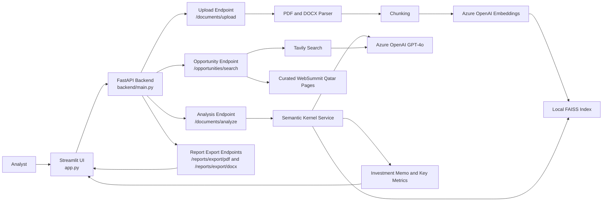
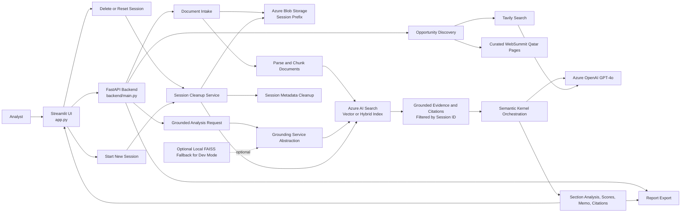

# Architecture Diagram

This file documents the current and target architectures for the Investment Analyst Agent.

## Architecture with local storage and FAISS

## Architecture with Azure Blob Storage and Azure AI Search

## Key Difference

In the local-storage and FAISS architecture, the analysis path retrieves local chunks directly from FAISS.

In the Azure Blob Storage and Azure AI Search architecture, uploaded files are stored in Azure Blob Storage, parsed and chunked by the backend, indexed in Azure AI Search, and then used to ground the analyst agent with session-filtered evidence and citations.

Both architectures treat deletion as part of the core design: reset, delete, and new-session events remove the old session's blobs, search records, and metadata.
